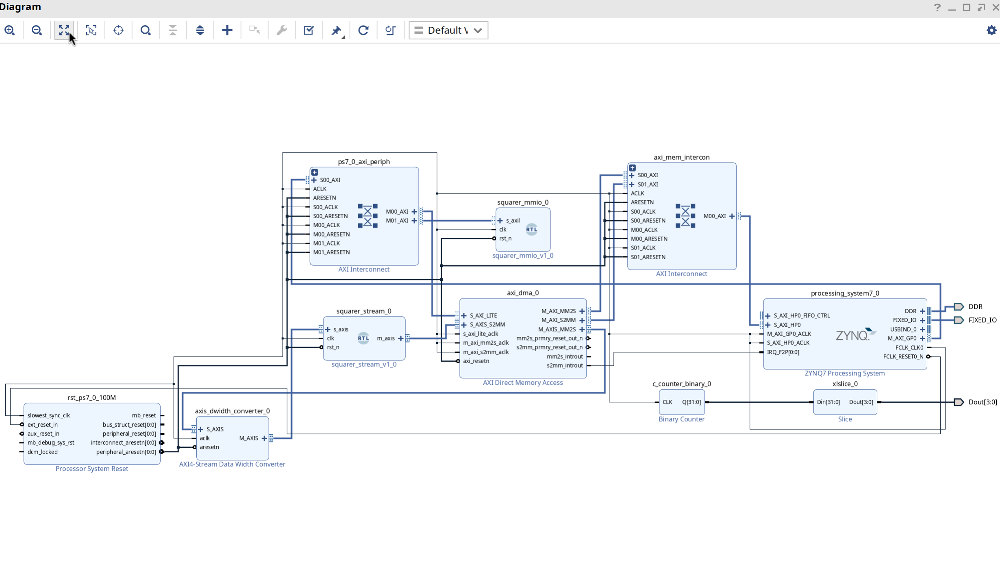
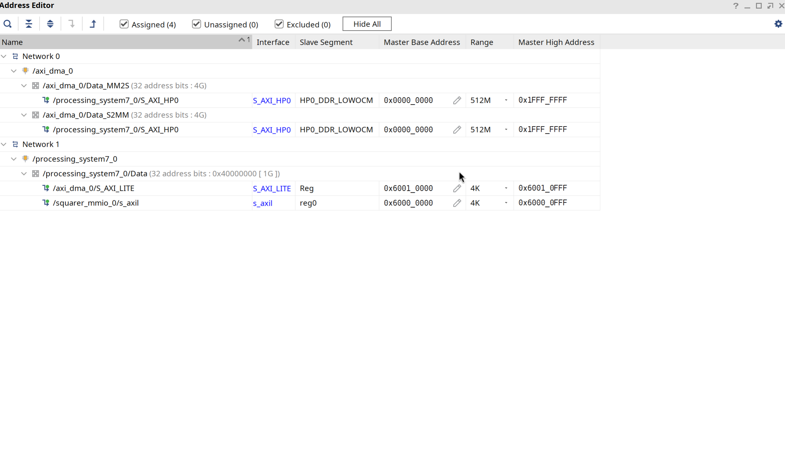

# 04 - Squarer: MMIO vs DMA

This experiment sends large blocks of data into the PL and computes `y = x * x`
on each sample, using two different data paths so you can compare their
throughput:

- **MMIO** (AXI-Lite): the CPU writes each input and reads each output, one
  sample at a time. Simple, but every access crosses the PS-PL boundary.
- **DMA** (AXI Stream + AXI DMA): the CPU sets up a transfer with a handful of
  register writes, then the AXI DMA streams the whole block through the
  hardware and raises an interrupt when done.

| Instance | Interface | CPU work per N samples |
|----------|-----------|------------------------|
| `squarer_mmio` | AXI-Lite registers | 2N (a write and a read per sample) |
| `squarer_dma` | AXI Stream via AXI DMA | ~4 register writes (setup only) |

A streaming interface moves data on a `valid`/`ready` handshake with no
addressing, which is what lets burst DMA reach much higher throughput than
per-address AXI-Lite access. Note the AXI DMA in the fabric is distinct from
the DMA controller inside the PS (the latter is used for things like Ethernet
and is not reachable from the fabric).

The RTL is in [`../squarer/rtl`](../squarer/rtl), the drivers in
[`../squarer/driver`](../squarer/driver), and the userspace test program in
[`../squarer/sw`](../squarer/sw).

## System overview

```
                          +------------------+
    +--------+            | squarer_mmio     |
    | Zynq   |---[GP0]--->| (AXI-Lite)       |
    |   PS   |            +------------------+
    |        |
    |        |            +------------------+     +----------------+
    |        |---[GP0]--->| AXI DMA          |<--->| squarer_stream |
    |        |            | (control)        |     | (AXI Stream)   |
    |        |            +------------------+     +----------------+
    |        |                  |
    |        |---[HP0]----------+ (data path)
    |        |
    |        |<-- IRQ_F2P[0] -- (DMA S2MM completion)
    +--------+
```

## Step 1: Create the Vivado project and add RTL

Create a project for the part `XC7Z020CLG400-1` and add both RTL sources:

- `squarer/rtl/squarer_mmio.v`
- `squarer/rtl/squarer_stream.v`

You do **not** need to package these as custom IPs. The block design adds them
as RTL module references and uses connection automation to wire up the AXI
interfaces, exactly as for the smart timer.

## Step 2: Build the block design



Add and configure these blocks:

1. **ZYNQ7 Processing System**
   - Run Block Automation.
   - PS-PL Configuration -> HP Slave AXI Interface -> enable **S AXI HP0**
     (this is the high-bandwidth port the DMA uses for the data path).
   - Interrupts -> Fabric Interrupts -> PL-PS -> enable **IRQ_F2P[0:0]**.

   

2. **squarer_mmio** - add the RTL module (right-click in the diagram ->
   Add Module -> `squarer_mmio`).

3. **AXI DMA** - double-click to configure:
   - Disable Scatter Gather.
   - Memory Map Data Width: 32.
   - Stream Data Width: 32 (the squarer output is 32-bit).
   - Max Burst Size: 256.

4. **squarer_stream** - add the RTL module the same way as `squarer_mmio`.

5. **AXI Interconnect** for the GP0 (control) connections.

6. **AXI SmartConnect** for the HP0 (data) connections.

7. **Concat** for the interrupt, if needed.

### Connections

Clock and reset: drive all IP clocks from `FCLK_CLK0`; use a Processor System
Reset block for synchronised resets.

Control path (AXI-Lite):

```
Zynq M_AXI_GP0 --> AXI Interconnect --> squarer_mmio (s_axil)
                                    --> AXI DMA (S_AXI_LITE)
```

DMA data path:

```
AXI DMA M_AXI_MM2S --> AXI SmartConnect --> Zynq S_AXI_HP0
AXI DMA M_AXI_S2MM --> AXI SmartConnect --> Zynq S_AXI_HP0
```

Stream path (the squarer input is 16-bit, output is 32-bit):

```
AXI DMA M_AXIS_MM2S --> [width converter if needed] --> squarer_stream s_axis (16-bit)
squarer_stream m_axis (32-bit) --> AXI DMA S_AXIS_S2MM (32-bit)
```

The simplest option is to configure the DMA stream widths to match directly
(MM2S 16-bit, S2MM 32-bit) and avoid a width converter. Otherwise insert an
AXI4-Stream Data Width Converter on the MM2S side.

Interrupt:

```
AXI DMA s2mm_introut --> Zynq IRQ_F2P[0:0]
```

## Step 3: Address map



| Block | Offset | Range |
|-------|--------|-------|
| `squarer_mmio` | `0x6000_0000` | 4K |
| `axi_dma` | `0x6001_0000` | 4K |

These must match the `reg` entries in [`../pynq-z1.dts`](../pynq-z1.dts).

## Step 4: Generate the bitstream

Validate the design (F6), generate the block design, create an HDL wrapper, run
synthesis and implementation, and Generate Bitstream. Export hardware if you
want the `.xsa`.

## Step 5: Device tree

In [`../pynq-z1.dts`](../pynq-z1.dts), uncomment the two squarer nodes and make
sure their `reg` values match the address map above:

```dts
squarer_mmio: squarer-mmio@60000000 {
    compatible = "demo,squarer-mmio";
    reg = <0x60000000 0x1000>;
    status = "okay";
};

squarer_dma: squarer-dma@60010000 {
    compatible = "demo,squarer-dma";
    reg = <0x60010000 0x1000>;
    interrupts = <0 29 4>;          // SPI 29 (IRQ_F2P[0]), level-high
    interrupt-parent = <0x04>;
    status = "okay";
};
```

**Important**: comment out the `smarttimer` node for this experiment. It uses
the same interrupt (SPI 29) as the DMA and the two will clash.

## Step 6: Build the drivers and test program

Both drivers live in the same folder and build together:

```bash
cd $LDIR/squarer/driver
make
make -C "$KDIR" M="$(pwd)" modules_install INSTALL_MOD_PATH=/tmp/initramfs
```

The userspace test program is copied into the initramfs by hand before the
kernel is rebuilt:

```bash
cd $LDIR/squarer/sw
make
cp ./test_squarer /tmp/initramfs
```

Now rebuild the kernel and `image.ub` (see
[02 - Kernel and boot image](./02-kernel-and-boot-image.md)), recompile the DTB
with the squarer nodes enabled, and copy the new `image.ub` to the SD card.

## Step 7: Run and compare

Boot the board, activate the level shifters (`devmem 0xF8000900 32 0xF`),
program the bitstream, then load the drivers and run the test:

```bash
insmod squarer_mmio.ko
insmod squarer_dma.ko
ls -l /dev/squarer_*           # /dev/squarer_mmio and /dev/squarer_dma

./test_squarer                 # no argument: N = 1024
./test_squarer 2048            # try values from 8 up to 2048
```

Example output (exact timings vary from run to run):

```
Squarer Driver Comparison
=========================
Samples: 1024

Testing MMIO driver (/dev/squarer_mmio)...
  Time: 2500000 ns (2500.00 us)
  Per sample: 2441 ns
  Errors: 0

Testing DMA driver (/dev/squarer_dma)...
  Time: 15000 ns (15.00 us)
  Per sample: 15 ns
  Errors: 0

Summary
-------
MMIO:   2500000 ns  (1024 samples, 2 reg ops each = 2048 MMIO ops)
DMA:      15000 ns  (1024 samples in single bulk transfer)
Speedup: 166.7x
```

Vary the input size and watch how the DMA advantage grows with N. If you add an
ILA on the AXI bus you can see the difference between the per-sample MMIO
accesses and the DMA burst transfer directly.

## How it works

Both drivers expose the same userspace interface:

```c
int fd = open("/dev/squarer_mmio", O_RDWR);   // or /dev/squarer_dma
write(fd, input,  n * sizeof(int16_t));        // provide input data
read(fd,  output, n * sizeof(int32_t));        // compute and read results
```

**MMIO (slow path)** - inside the driver's `read()`:

```c
for (i = 0; i < n; i++) {
    writel(input[i], base + REG_DATA_IN);   // write to HW register
    output[i] = readl(base + REG_DATA_OUT); // read from HW register
}
```

Each access crosses the PS-PL boundary (~1-2 us). For 1024 samples that is
~2048 MMIO operations.

**DMA (fast path)** - inside the driver's `read()`:

```c
writel(input_dma_addr,  dma_base + MM2S_SA);     // source address
writel(input_bytes,     dma_base + MM2S_LENGTH); // kicks off MM2S
writel(output_dma_addr, dma_base + S2MM_DA);     // dest address
writel(output_bytes,    dma_base + S2MM_LENGTH); // kicks off S2MM
// then wait for the S2MM completion interrupt
```

A few register writes, then the hardware streams the whole block at roughly one
word per clock.

## Key takeaways

1. **MMIO is simple but slow** - every register access carries ~1 us overhead.
2. **DMA needs setup but is fast** - a few register writes, then the hardware
   does the work.
3. **The speedup scales with data size** - more samples, bigger DMA advantage.
4. **The driver interface hides the complexity** - both paths use the same
   `write`/`read` API from userspace.
