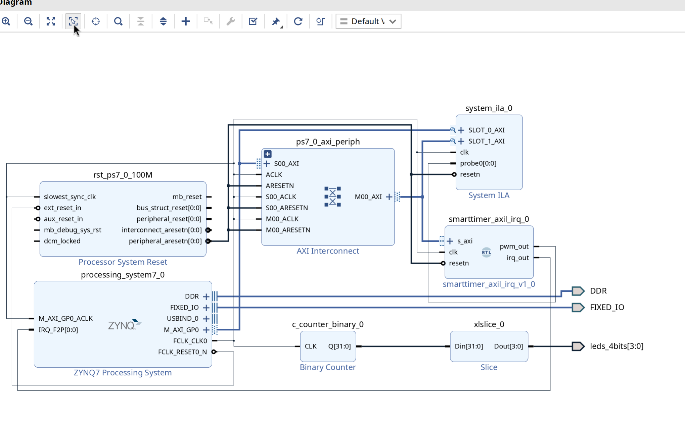

## Vivado design of smart timer module

### Create Vivado project

Create a new project in Vivado.  Make sure you select the correct part number for the FPGA board at hand.  It is also possible to install files that allow you to directly select the board instead of the part, but they are not there by default, and for now we are not going to assume this is available.

Add the RTL code in the `smarttimer/rtl` folder to the project.  You may see the module with the AXI lite interface becoming the *top* module of the project: ignore this for now.

Create a new block design - you can give it any name you want.  Then start adding modules to it to recreate the block design as seen in the figure:



Note the following:

- Run "Connection automation" and "Block automation" as needed and Vivado will do a lot of the work automatically for you.
- Double click on the Zynq PS to open it, and make sure of the following settings:
    - Clock: PS to PL Fabric clock should be enabled (`FCLK0`) and set to 100 MHz (50 is also OK if you want to leave it)
    - Interrupts: Turn on Fabric to PS interrupts - these are the Shared Peripheral Interrupts, and correspond to interrupts 61-68 and so on.  We will use only one interrupt, which will by default get mapped to interrupt 61.  This corresponds to interrupt number 29 (61-32) in the device tree spec.
- You must open the Address Editor and ensure that the address that is given for the smart timer there matches with the entry in the device tree spec.  Otherwise the kernel will not be able to find or communicate with the device, and the entire system will hang when you try accessing an address that does not have proper hardware connected to it.

### ILA and debug

Note that the design contains an integrated logic analyzer (ILA) as well as a counter and some output pins.  

The ILA contains a mix of AXI ports (one to check the input of the AXI interconnect and the other for the output - you could also just make do with one port instead), and a regular port that is used to visualize the `pwm_out` signal.  This can be clearly seen when you turn on the timer with the `ctrl` port and the PWM should activate with appropriate period and duty cycle.

The counter is used mainly as a "sign of life" indicator.  When the level shifters are turned on (see instructions for running the kernel) you should be able to see the LEDs blinking.  Keep in mind that the input clock is supposed to be 100 MHz, so the reason for the counter and the *slice* is to pick out a suitable set of signals that will make the LEDs blink at a visible frequency.

### Pin constraints

Make sure to add a pin constraint file (name does not matter) that contains lines mapping the counter slice output to the LEDs.  This is purely for debugging, but without the mapping the bitstream generation will fail.

### Module compilation and installation

There are two sets of drivers for the smart timer.  One is a plain platform driver, and the other also handles IRQs.  In this case we are creating a single bitfile that already has the IRQ connected, and both the drivers are associated with the same compatibility string in the DTB, so they can be tested together.

To compile the modules, go into the respective folders and enter the following commands:

```bash
make   # To compile the module
# To install the module to the initramfs (must be done after busybox)
make -C "$KDIR" M="$(pwd)" modules_install INSTALL_MOD_PATH=/tmp/initramfs
```

After this, once again compile the kernel:

```
make -j4 -C $KDIR
```

and you will get the `zImage` that needs to then be packed into the `image.ub`.

