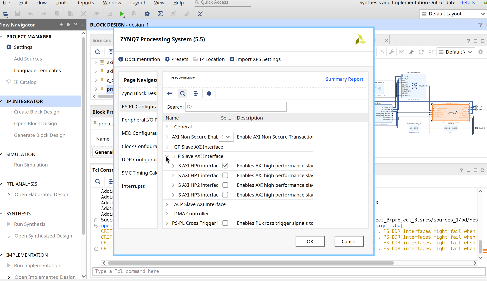

# Vivado Project Setup for Squarer Demo

This guide describes how to create the Vivado block design with two squarer
instances: one using MMIO (slow) and one using DMA (fast).

## Overview

```
                          +------------------+
    +--------+            | squarer_mmio     |
    | Zynq   |---[GP0]--->| (AXI-Lite)       |
    |   PS   |            +------------------+
    |        |
    |        |            +------------------+     +----------------+
    |        |---[GP0]--->| AXI DMA          |<--->| squarer_stream |
    |        |            | (control)        |     | (AXI Stream)   |
    |        |            +------------------+     +----------------+
    |        |                  |
    |        |---[HP0]----------+ (data path)
    |        |
    |        |<-- IRQ_F2P[0] -- (DMA S2MM completion)
    +--------+
```

## Images

### Vivado Block Design


### Address Map


### Enable HP port




## Step 1: Add RTL Sources

1. Create new Vivado project for PYNQ-Z1 (xc7z020clg400-1)
2. Add RTL sources:
   - `squarer/rtl/squarer_mmio.v`
   - `squarer/rtl/squarer_stream.v`

You do not need to package these as custom IPs. The block design below
adds them as RTL module references and uses connection automation to wire
up the AXI interfaces, exactly as in the smart timer design.

## Step 2: Create Block Design

1. IP Integrator -> Create Block Design
2. Name: `squarer_demo`

### Add Blocks

1. **ZYNQ7 Processing System**
   - Run Block Automation
   - Double-click to configure:
     - PS-PL Configuration -> HP Slave AXI Interface -> Enable S AXI HP0
     - Interrupts -> Fabric Interrupts -> PL-PS -> IRQ_F2P[0:0]

2. **squarer_mmio** (add the RTL module: right-click in the diagram ->
   Add Module, then select `squarer_mmio`)

3. **AXI DMA**
   - Double-click to configure:
     - Disable Scatter Gather
     - Memory Map Data Width: 32
     - Stream Data Width: 32 (output is 32-bit)
     - Max Burst Size: 256

4. **squarer_stream** (add the RTL module the same way as `squarer_mmio`)

5. **AXI Interconnect** (for GP0 connections)

6. **AXI SmartConnect** (for HP0 connections)

7. **Concat** (for interrupts if needed)

## Step 3: Connect the Design

### Clock and Reset
- FCLK_CLK0 -> all IP clocks
- Use Processor System Reset for synchronized resets

### AXI-Lite Path (Control)
```
Zynq M_AXI_GP0 --> AXI Interconnect --> squarer_mmio (s_axil)
                                    --> AXI DMA (S_AXI_LITE)
```

### AXI DMA Data Path
```
AXI DMA M_AXI_MM2S --> AXI SmartConnect --> Zynq S_AXI_HP0
AXI DMA M_AXI_S2MM --> AXI SmartConnect --> Zynq S_AXI_HP0
```

### AXI Stream (Data Flow)

NOTE: Input is 16-bit, output is 32-bit. You may need width converters.

```
AXI DMA M_AXIS_MM2S (32-bit) --> AXI4-Stream Data Width Converter --> squarer_stream s_axis (16-bit)
squarer_stream m_axis (32-bit) --> AXI DMA S_AXIS_S2MM (32-bit)
```

For simplicity, configure DMA with 16-bit stream width on MM2S side:
- MM2S Stream Data Width: 16
- S2MM Stream Data Width: 32

Or use direct connection if widths match.

### Interrupts
```
AXI DMA s2mm_introut --> Zynq IRQ_F2P[0:0]
```

## Step 4: Address Map

| Block | Offset | Range |
|-------|--------|-------|
| squarer_mmio | 0x6000_0000 | 4K |
| axi_dma | 0x6001_0000 | 4K |

These offsets and ranges must match the `reg` entries in `pynq-z1.dts`.

## Step 5: Generate and Export

1. Validate Design (F6)
2. Generate Block Design
3. Create HDL Wrapper
4. Generate Bitstream
5. File -> Export Hardware (include bitstream)

## Block Design Diagram

```
+-------------------------------------------------------------------------+
|                                                                         |
|   +-------------+      +------------------+                             |
|   | Zynq PS     |      | squarer_mmio     |                             |
|   |             |      |                  |                             |
|   | M_AXI_GP0 --|----->| s_axil           |                             |
|   |             |  |   +------------------+                             |
|   |             |  |                                                    |
|   |             |  |   +------------------+      +------------------+   |
|   |             |  +-->| AXI DMA          |      | squarer_stream   |   |
|   |             |      |                  |      |                  |   |
|   |             |      | M_AXIS_MM2S -----+----->| s_axis (16-bit)  |   |
|   | S_AXI_HP0 <-+------| M_AXI_MM2S       |      |                  |   |
|   |             |      | M_AXI_S2MM       |      | m_axis (32-bit) -+--+|
|   |             |      |                  |      +------------------+  ||
|   | IRQ_F2P[0] <+------| s2mm_introut     |<---------------------------+|
|   |             |      | S_AXIS_S2MM <----+-----------------------------+
|   +-------------+      +------------------+                             |
|                                                                         |
+-------------------------------------------------------------------------+
```

## Quick Verification

After loading bitstream and drivers:

```bash
# Load drivers
insmod squarer_mmio.ko
insmod squarer_dma.ko

# Run test
./test_squarer 1024
```

Example output (exact timings will vary from run to run):
```
Squarer Driver Comparison
=========================
Samples: 1024

Testing MMIO driver (/dev/squarer_mmio)...
  Time: 2500000 ns (2500.00 us)
  Per sample: 2441 ns
  Errors: 0

Testing DMA driver (/dev/squarer_dma)...
  Time: 15000 ns (15.00 us)
  Per sample: 15 ns
  Errors: 0

Summary
-------
MMIO:   2500000 ns  (1024 samples)
DMA:      15000 ns  (1024 samples in single bulk transfer)
Speedup: 166.7x
```
